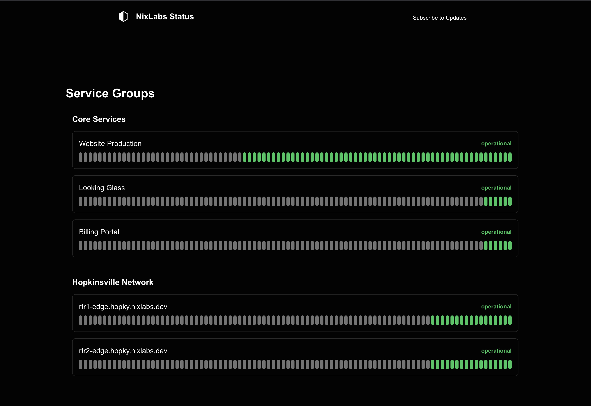

# NixLabs Networks Status Page

This is a simple status page built with **Next.js** for **NixLabs Networks**. It provides real-time monitoring and reporting of the current status of NixLabs' infrastructure.

## Features

- Real-time status updates
- Simple and clean design
- Built with Next.js for performance and scalability

## Screenshot



## Setup

To get started with the NixLabs Networks Status Page, follow these steps:

### Prerequisites

- Node.js (v18 or later)
- npm (v7 or later)

### Installation

1. Clone the repository:

   ```bash
   git clone https://github.com/NixLabsNetworks/status-page.git
   cd status-page
